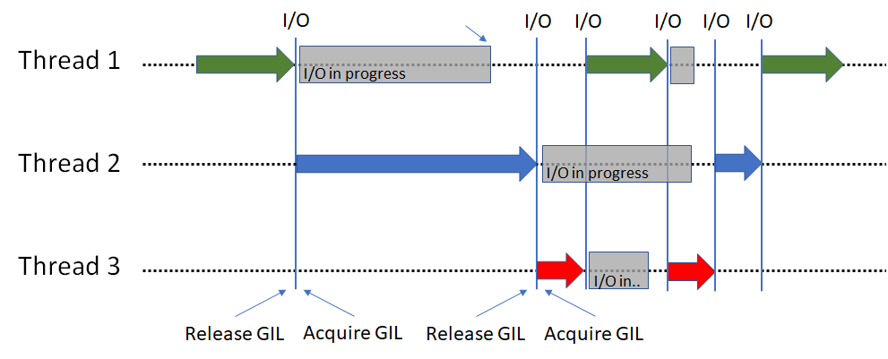

## IO intensive --> Concurrent --> Use Threads

Python threads are only useful when functions take a long time because of IO (releases the GIL)
Python threads are real system threads but parallel execution is forbidden because of GIL.



Example of functions that releases the GIL:
- Downloading
- requesting an URL
- opening a file...

Python libraries that releases the GIL:
- `requsets`
- `numpy`
- [`faiss`](https://github.com/facebookresearch/faiss/issues/924#issuecomment-524756847)
- `time.sleep(3)` is not equivalent to a loop running for 3 seconds, burning CPU cycles while holding the GIL lock. The thread is switched away from for 3 seconds, allowing other threads to run. https://stackoverflow.com/a/61809931

> http://www.dabeaz.com/python/UnderstandingGIL.pdf


## CPU instensive --> Parallel --> use Multiprocessing


## Conclusion

|                          | `asyncio`    | `threading`  | `multiprocessing` |
|--------------------------|--------------|--------------|-------------------|
| Great for                | Concurrency  | Concurrency  | Parallelism       |
|                          | `_-_-_-_-`   | `_-_-_-_-`   | `====`            |
| Great for                | IO intensive | IO intensive | CPU instensive    |
| swithing is controled by | Program      |     OS       |        OS         |
| Access to same objects   |  Yes         | Yes          | No, IPC is needed |


https://superfastpython.com/learning-paths/


```python
from threading import Thread


def worker():
    """thread worker function"""
    print('Worker')


t = Thread(target=worker)
t.start()
```


## Producer & consumer in parallel -> queue


```python
# SuperFastPython.com
# example of using the queue with processes
from time import sleep
from random import random
from multiprocessing import Process, Queue
 
# generate work
def producer(queue):
    print('Producer: Running', flush=True)
    # generate work
    for i in range(10):
        # generate a value
        value = random()
        # block
        sleep(value)
        # add to the queue
        queue.put(value)
    # all done
    queue.put(None)
    print('Producer: Done', flush=True)
 
# consume work
def consumer(queue):
    print('Consumer: Running', flush=True)
    # consume work
    while True:
        # get a unit of work
        item = queue.get()
        # check for stop
        if item is None:
            break
        # report
        print(f'>got {item}', flush=True)
    # all done
    print('Consumer: Done', flush=True)
 
# entry point
if __name__ == '__main__':
    # create the shared queue
    queue = Queue(maxsize=50)
    # start the consumer
    consumer_process = Process(target=consumer, args=(queue,))
    consumer_process.start()
    # start the producer
    producer_process = Process(target=producer, args=(queue,))
    producer_process.start()
    # wait for all processes to finish
    producer_process.join()
    consumer_process.join()
```