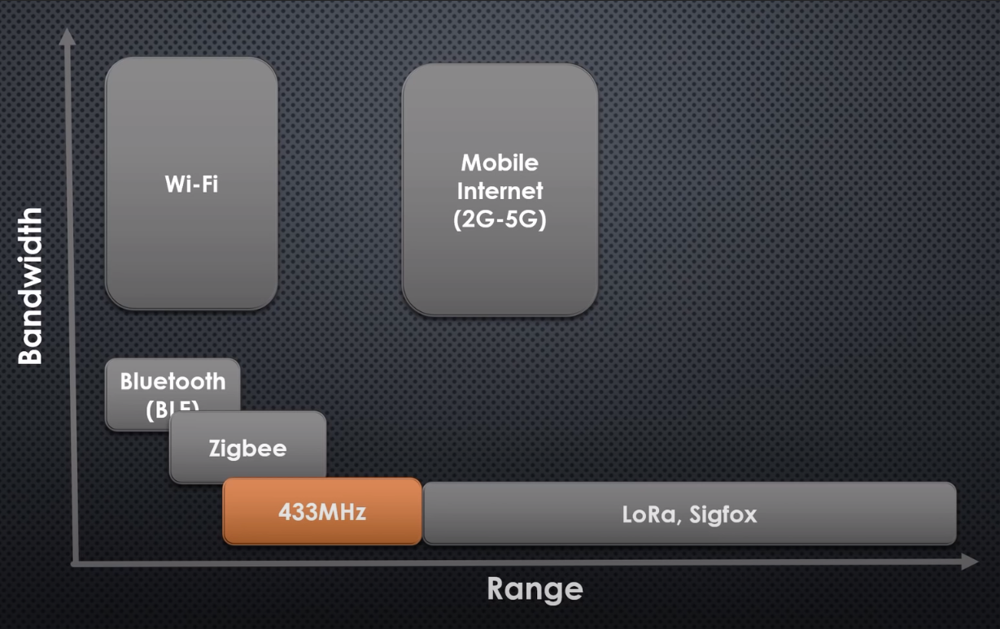

<h1 align="center">Networks and Communication</h1>

> - HTTP + Websocket (no tiene TCP, seguridad, ...) Segun pedro muy malo para IoT, solo existe pq hay desarrolladores web
> - MQTT (tiene TCP) Segun pedro mucho mejor para IoT

# OSI layers

- Application layer: (OSI 5-7)
  - HTTP
  - HTTPS
  - MQTT (Message Queue Telemetry Transport) 
  - CoAP
  - email (pop3)
- Transport layer (OSI 4)
  - TCP
  - UDP
- Network layer (OSI 3)
  - IP
- Link layer (OSI 2) and Physical layer (OSI 1)
  - Wire
    - Ethernet (IEEE 802.3)
    - Token bus (IEEE 802.4)
    - Token ring (IEEE 802.5) (topología en anillo)
    - USB
  - Wireless
    - Wi-Fi (IEEE 802.11x)
    - Bluetooth (IEEE 802.15.1)
    - Bluetooth LE
    - GSM/GPRS/HSPA/LTE
    - LoRa
    - SigFox
    - ZigBee (IEEE 802.15.4) (Para hacer red malla)
    - NFC (Near Field Communication)
    - Radio Frequency (RF de 433MHz) (RFID)
    - Infrared (IR)

## [Radio spectrum](https://en.wikipedia.org/wiki/Radio_spectrum)

- Altos en MHz -> Mas datos pero a poca distancia y sin obtaculos
- Bajos en MHz -> Menos datos pero gran distancia y gran poder de penetracíon en paredes.

| Band name                         | Frequency     | Wavelength        | Example Uses
|-----------------------------------|---------------|-------------------|-----------------------------
| Extremely low frequency (ELF)     | 3–30 Hz       | 100.000–10.000 km | submarines
| Super low frequency (SLF)         | 30–300 Hz     | 10,000–1,000 km   | submarines
| Ultra low frequency (ULF)         | 300–3000 Hz   | 1,000–100 km      | submarines, mines and caves
| Very low frequency (VLF)          | 3–30 kHz      | 100–10 km         | Navigation
| Low frequency (LF)                | 30–300 kHz    | 10–1 km           | Navigation, AM longwave
| Medium frequency (MF)             | 300–3,000 kHz | 1,000–100 m       | AM (medium-wave)
| High frequency (HF)               | 3–30 MHz      | 100–10 m          | 
| Very high frequency (VHF)         | 30–300 MHz    | 10–1 m            | FM, television
| Ultra high frequency (UHF)        | 300–3,000 MHz | 1–0.1 m           | Mobile phones, Wifi 2.4G, Bluetooth, ZigBee, GPS
| Super high frequency (SHF)        | 3–30 GHz      | 10–1 cm           | Wifi 5G
| Extremely high frequency (EHF)    | 30–300 GHz    | 10–1 mm           | 
| Tremendously high frequency (THF) | 300–3,000 GHz | 1–0.1 mm          | 

## Frecuancy Bands in Spain at 2020

| Techonology      |   Band  | Frecuancies (MHz) | Cost    |
|------------------|--------:|---------|
| Radio Frequency  |   315   |               | Private |
| Radio Frequency  |   EU433 | 433.05-434.79 | Free |
| Televisión (TDT) | 694-790 | Private |
| LORA             |   800   | Free    |
| Movil 4Genration |   820   | Private |
| SigFox (Europe)  |   868   | Private |
| ZigBee (Europe)  |   868   | Private |
| Movistar         |   900   | Private |
| Orange           |  1100   | Private |
| Wifi 2.4G        |  2400   | Free    |
| Wifi 5G          |  5000   | Free    |

- Movil 1G: Para hablar solamente por voz. 
- Movil 2G: Conexión de voz y datos por GPRS (SMS).
- Movil 3G: Esta tecnología ofrece voz y datos de alta velocidad. Videollamadas y transferecia de datos.
- Movil 4G: Ofrece datos de alta velocidad pero no voz. Ha sido desarrollada debido al auge de los smartphones. 
- Movil 5G: Se prevé que el 2020 empiece a instalarse, aunque se desconoce su fecha de finalización.
- https://xacom.com/frecuencias-operadoras-espana-2g-3g-4g-5g/

> La televisión analógica ha utilizado para su emisión desde principios del segundo cuarto del pasado siglo XX, parte de la banda de frecuencias de VHF (47 a 230 MHz) y parte de la banda de UHF (470 a 862 MHz

> la banda ISM para usos industriales, científicos y médicos; en concreto, 868 MHz en Europa, 915 en Estados Unidos y 2,4 GHz en todo el mundo.

### Redes de baja pontecia
- 64 bytes de mensaje. (No cabe un protocolo como TCP.
- Son redes para mandar datos pequeños
- Es una radio muy básica. (no tiene comfirmacíon de vuelta de que al receptor le ha llegado el mensaje)
- Trabajan en 800MHz. (es como una wifi muy grande).
  - Con una antena de 5.600€ cubres 24km de radio. (largo alcance)
  - Este espectro es libre (fuera del espectro movil y tv) (no hay que pagar al gobierno para usarlo)
- 1.5 woltios de pila tienes 4 años de uso ininterrumpido.
- Ejemplos
  - **LORA**
  - **LoWPAN**
  - **sigfow** (para mandar alarmas de suguridad)

### Sin clasificar en el modelo OSI
- Modbus
- SOAP
- sockets
- web socket
- web services
- Ultrawidband (UWB)
- Serial port
- UART
- HDBaseT: protocolo para dejar el ordenador lejos (hasta 100 metros de distancia) y conetar todo (video, USB) por un cable Ethernet (categoría 5E para distancias cortas o categoria 6 o 7 para distancias largas).

### Links

- https://aprendiendoarduino.wordpress.com/category/conectividad-iot/
- https://es.slideshare.net/AnshuPandey5/iot-communication-protocols-socket-programming-with-python-mqtt-http
- https://realpython.com/python-sockets/
- https://aprendiendoarduino.wordpress.com/2018/11/19/mqtt/
- CURSOS
  - https://www.coursera.org/learn/computer-networking
  - https://www.coursera.org/specializations/networking-google-cloud-platform
  - https://www.coursera.org/learn/fundamentals-network-communications#syllabus
  - https://www.udacity.com/course/computer-networking--ud436
  - https://www.coursera.org/learn/iot-wireless-cloud-computing?specialization=emerging-technologies
  - https://www.udacity.com/course/high-performance-computing--ud281
  - https://www.youtube.com/watch?v=FGdiSJakIS4
  - https://www.coursera.org/learn/ar-technologies-video-streaming?specialization=emerging-technologies
  - https://learn.saylor.org/course/index.php?categoryid=9
