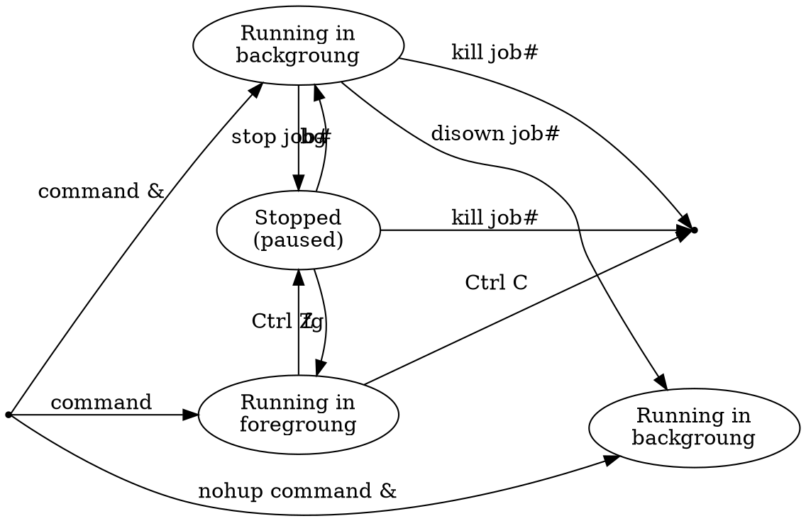

# Processes


## Basics

- A process is an instance of a program/command.
- Each process has a unique PID (5 digits number).
- Every process has a parent (the one who create the process).
- When you close/kill the parent pocess you kill all the child processes
- How to start a process:
	- Manually (run command in terminal)
	- At boot time (services or daemons)
	- Scheduled ( crontab )
	- From anothter process (child process)


====== PROCESSES

COMMAND &      # EJecuta el proceso n 2o plano


diswon         # independiza el proceso


pwdx 1732127  # En que ruta se inicio el proceso con PID=1732127


## `lsof`

Lists open files (belonging to active processes).

- `lsof -i:80`  Que procesos eta ocupando el puerto 80
- `lsof -iTCP -sTCP:LISTEN` to list all processes that are listening on a TCP port for network requests.

https://copyconstruct.medium.com/lsof-f2b224eee7b5


## `socat`


- `socat TCP-LISTEN:9000,fork,reuseaddr,bind=localhost TCP:$HOSTNAME:9000`: If the connection is refused by the server, will use socat to forward traffic from localhost:9000 to $HOSTNAME:9000 and back.


https://copyconstruct.medium.com/socat-29453e9fc8a6


## `ss`

Sockets


## Your system is alive!


- `inotify`: monitoring filesystem events
- `inotifywait`: wait for changes to files using inotify
- `iostat`: Report Central Processing Unit (CPU) statistics and input/output statistics for devices, partitions and network filesystems (NFS).


## Processes VS Jobs

A job is a concept used by the shell. Foreground process, backegraund process and suspended processces in the current shell is a job.

You can have a large number of background jobs running at the same time, but you can only have one foreground job

|            | processes                           | jobs                           |
|------------|-------------------------------------|--------------------------------|
| definition | instances of a program/command      | processes of the current shell |
| tracked by | the Operating System                | the current shell              |
| identifier | pid (example: `1`)                  | jobspec (example: `%1`)        |
| see all    | `ps`                                | `jobs`                         |
| commands   | `kill`, `wait`, `disown`, `suspend` | `fg`, `bg`, `jobs`


| Action                                    | Command      | Shortcut |
|-------------------------------------------|--------------|----------|
| Start a foreground process                | `command`    |          |
| Start a background process (shell depen.) | `command &`  |          |
| Start a background process (independent)  | `nohup command &` |     |
| See all the jobs (running & stopped)      | `jobs`       |          |
| Stop/pause current process (SIGSTOP)      | `stop {PID}` | `Ctrl Z` |
| Resume last stopped job in background     | `bg`         |          |
| Resume last stopped job in foreground     | `fg`         |          |
| Resume job number 2 in foreground         | `fg %2`      |          |
| Waits for all background jobs to finish   | `wait`       |          |
| Waits for job number 1 to finish          | `wait %1`    |          |
| Independice all background jobs           | `disown -a`  |          |
| Kill/finish job (SIGINT)                  | `kill {PID}` | `Ctrl C` |
| Kill/finish job (SIGQUIT)                 |              | `Ctrl \` |
| Clean terminal                            |              | `Ctrl L` |




> - https://copyconstruct.medium.com/bash-job-control-4a36da3e4aa7
> - https://www.baeldung.com/linux/foreground-background-process
> - https://www.baeldung.com/linux/jobs-job-control-bash
> - https://fsl.fmrib.ox.ac.uk/fslcourse/unix_intro/job.html


> Coprocess
> https://copyconstruct.medium.com/bash-coprocess-2092a93ad912


## Process states

Processes can have several states:

- Running (R)
- Uninterruptible Sleep (D)
- Interruptable Sleep (S)
- Stopped (T)
- Zombie (Z)


## Processes and Threads


## Process priorities

https://www.tecmint.com/set-linux-process-priority-using-nice-and-renice-commands/


## Tracking ongoing processes (`ps`)

- `ps` (Process status) can be used to see/list all the running processes.
- `ps -f` (full) For more information variables
- `ps 19` For single-process information, ps along with process id is used  


UID:   User ID that this process belongs to (the person running it)
PID:   Process ID
PPID:  Parent process ID (the ID of the process that started it)
C:     CPU utilization of process
STIME: Process start time
TTY:   Terminal type associated with the process
TIME:  CPU time is taken by the process
CMD:   The command that started this process

  UID   PID  PPID   C STIME   TTY           TIME CMD
    0     1     0   0  5may22 ??        98:12.93 /sbin/launchd
    0    69     1   0  5may22 ??         4:07.06 /usr/sbin/syslogd


### Process managers

- launchd (OS X)
- Upstart (Ubuntu) (antiguo y tradicional sistema init)
- SystemV (SysV) (antiguo y tradicional sistema init)
- SystemD (el mas usado (y odiado) en la acutailidad
- Systemd-shim (alternativa moderna)
- In BSD, the init binary doesn't do much regarding startup, basically just executes /etc/rc; it's shell scripts all the way afterwards.


|         | SystemV                               | SystemD                                                 |
|---------|---------------------------------------|---------------------------------------------------------|
| Distros | Gentoo, Slackware, Linux from Scratch | ArchLinux, AWS, Red Hat, CentOS, Fedora, Debian, Ubuntu |
| Restart |  `/etc/init.d/sshd start`             | `systemctl restart sshd`                                |
| Enable  |                                       | `systemctl enable NetworkManager.service`               |
|         |                                       | `systemctl enable wpa_supplicant`                       |


https://papers.freebsd.org/2018/bsdcan/rice-the_tragedy_of_systemd/


FreeBSD ventajas: init system, LLVM, documentation, ZFS, dtrace


### Boot time (System V)

1. **BIOS** (Basic Input/Output System)
2. **MBR** (Master Boot Record)
3. **GRUB** (Grand Unified Bootloader)
4. **Kernel**
	- Mounts the root file system as specified in the “root=” in grub.conf
	- Kernel executes the `/sbin/init` program
5. **Init** (PID=1)
	- Es el primer proceso que se inicia durante el arranque del sistema por parte del kernel.
	- Se ejecutará en segundo plano continuamente hasta que el sistema se apague.
	- Lee el archivo `/etc/inittab` para decidir el nivel de ejecución de Linux.
	- luego inicia todos los demás procesos.
	- Run level 0 –> halt (CAUTION: never set initdefault to this)
	- Run level 1 –> Single user mode
	- Run level 2 –> Multiuser, without NFS (The same as 3, if you do not have networking)
	- Run level 3 –> Full multiuser mode (common initdefault)
	- Run level 4 –> unused
	- Run level 5 –> X11 (common initdefault)
	- Run level 6 –> reboot (CAUTION: never set initdefault to this)
	- Ejemplo de inittab: `id:3:initdefault:`
6. **Runlevel programs**
Depending on your default init level setting, the system will execute the programs from one of the following directories.
	- Run level 0 –> `/etc/rc.d/rc0.d/`
	- Run level 1 –> `/etc/rc.d/rc1.d/`
	- Run level 2 –> `/etc/rc.d/rc2.d/`
	- Run level 3 –> `/etc/rc.d/rc3.d/`
	- Run level 4 –> `/etc/rc.d/rc4.d/`
	- Run level 5 –> `/etc/rc.d/rc5.d/`
	- Run level 6 –> `/etc/rc.d/rc6.d/`
  - Programs starts with S are used during startup. S for startup.
  - Programs starts with K are used during shutdown. K for kill.


Ejemplo de un script que:

```bash
#      ┌───────────── rc3: Será ejecutado en el Run level 3
#      │   ┌───────── S:   Será ejecutado al encenderse
#      │   │ ┌─────── 98:  Momento de ejecución, a menor número, antes se ejecuta
#      │   │ │  
/etc/rc3.d/S98miscript

# Puede ser un enlace simbolico a un script que esté en otro sitio
ln -s  /etc/init.d/mi_script /etc/rc3.d/S98miscript
```


Reference: https://www.thegeekstuff.com/2011/02/linux-boot-process/


### Boot time (SystemD)

SystemD uses "targets" instead of runlevels.

By default, there are two main targets:
- multi-user.target: analogous to runlevel 3
- graphical.target: analogous to runlevel 5


```bash
# To view current default target, run:
systemctl get-default

# To set a default target, run:
#systemctl set-default TARGET.target

# Establezca el nivel de ejecución actual en 3 (comenzar en modo de línea de comando)
systemctl set-default multi-user.target
 
# Establezca el nivel de ejecución actual en 5 (encendido para la interfaz gráfica)
systemctl set-default graphical.target
```


## Proc dir

It has PID 28, so we check the /proc


## Inter Process Comunication (IPC)

- Shared files
- Shared memory (with semaphores)
- Pipes
  - unnamed pipes `|`
  - named pipes `mkfifo my_pipe`
- Message queues
- Sockets
  - Unix domain sockets
  - TCP/IP sockets
- Signals
- semaphores


- https://www.digitalocean.com/community/tutorials/how-to-use-top-netstat-du-other-tools-to-monitor-server-resources
- https://www.digitalocean.com/community/tutorials/how-to-use-ps-kill-and-nice-to-manage-processes-in-linux
- https://www.digitalocean.com/community/tutorials/understanding-systemd-units-and-unit-files
- https://opensource.com/article/20/1/inter-process-communication-linux
- https://opensource.com/downloads/guide-inter-process-communication-linux


