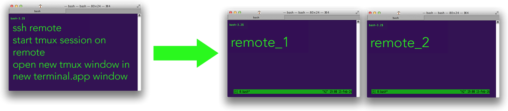

# TMUX

The most popular terminal multiplexer these days is [`tmux`](https://www.man7.org/linux/man-pages/man1/tmux.1.html).
- tmux can have several **sessions**.
- a **session** can have several **windows** (like tabs)
- a **window** can have several **panes** (like a divided terminal)


## Commands

- **Outside tmux**
  - `tmux`: starts a new session.
  - `tmux new -s NAME`: starts it with that name.
  - `tmux ls`: lists the current sessions.
  - `tmux a`: attaches the last session.
  - `tmux -t sesName`: attaches to specific session.
  - `tmux kill-server`: Removes all sessions and kill tmux server
- **Inside tmux**:
  - `[Ctrl+b] c`: Creates a new window. To close it you can just terminate the shells doing `<C-d>`
  - `[Ctrl+b] 0`: Go to window 0
  - `[Ctrl+b] 1`: Go to window 1
  - `[Ctrl+b] 2`: Go to window 2
  - `[Ctrl+b] p`: Go to the previous window
  - `[Ctrl+b] n`: Go to the next window
  - `[Ctrl+b] ,`: Rename the current window
  - `[Ctrl+b] w`: List current windows
  - `[Ctrl+b] d`: Detaches the current session (remains active in background)
  - `[Ctrl+d] x`: Kill the current pane/window(if1pane)/sesion(if1window)
- **Panes**: Like vim splits, panes let you have multiple shells in the same visual display.
  - `[Ctrl+b] "` Split the current pane horizontally
  - `[Ctrl+b] %` Split the current pane vertically
  - `[Ctrl+b] <direction>` Move to the pane in the specified _direction_. Direction here means arrow keys.
  - `[Ctrl+b] z` Toggle zoom for the current pane
  - `[Ctrl+b] [` Start scrollback. You can then press `<space>` to start a selection and `<enter>` to copy that selection.
  - `[Ctrl+b] <space>` Cycle through pane arrangements.


## [iTerm2 TMUX Integration](https://iterm2.com/documentation-tmux-integration.html)

**Each TMUX window will be a real window**.

- `tmux -CC`: Create a new session
- `tmux -CC attach` Attach to



> Reference: https://stackoverflow.com/questions/35421819/tmux-in-multiple-terminal-app-windows


## TMUX Server ([Autostart with systemd](https://wiki.archlinux.org/title/tmux#Autostart_with_systemd))

Put this file in `/etc/systemd/system/tmux.service`:
> - `cd /etc/systemd/system`
> - `sudo nano tmux.service`

```
[Unit]
Description=Tmux server

[Service]
Type=forking
User=javi
ExecStart=/usr/bin/tmux new -s 0 -d
ExecStop=/usr/bin/tmux kill-server

[Install]
WantedBy=multi-user.target
```

Enable service with: `sudo systemctl enable tmux.service`

## Learn more

- Video de s4vitar: [Aprendiendo a usar tmux desde 0](https://www.youtube.com/watch?v=1dDahc214co)
- [Practical Tmux](https://mutelight.org/practical-tmux)
- https://hackernoon.com/using-tmux-to-improve-your-terminal-experience-jt4932zv
