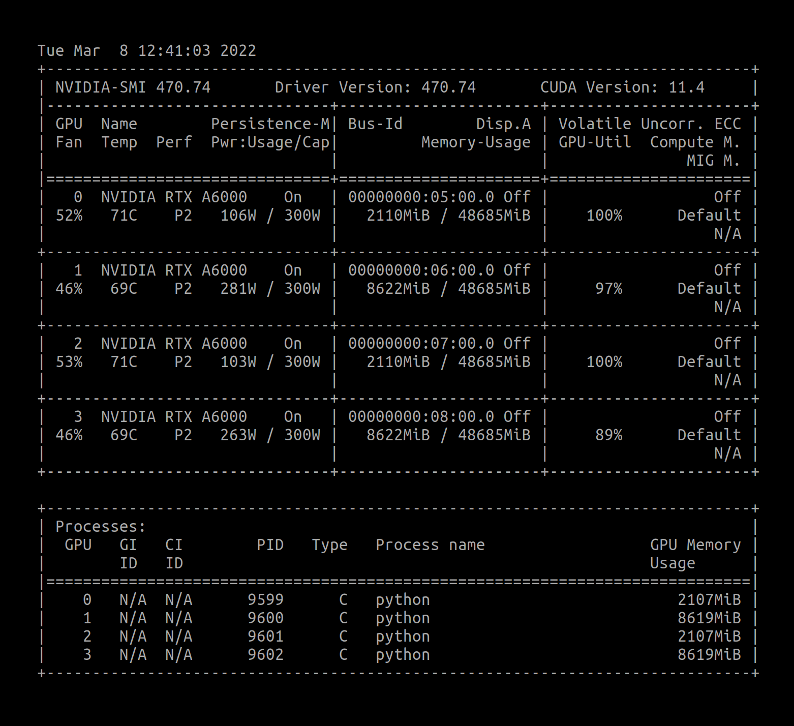
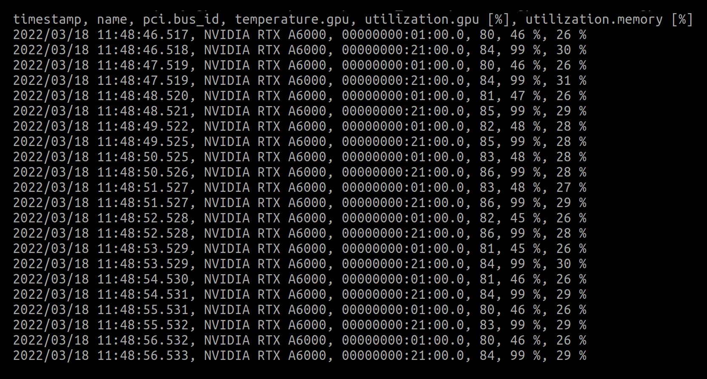
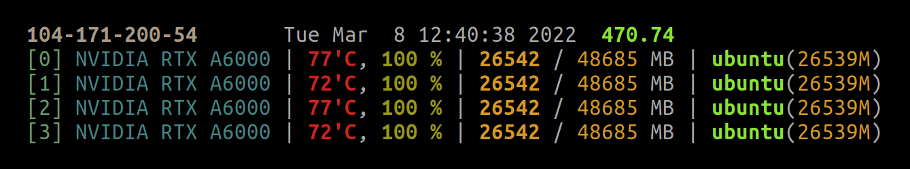
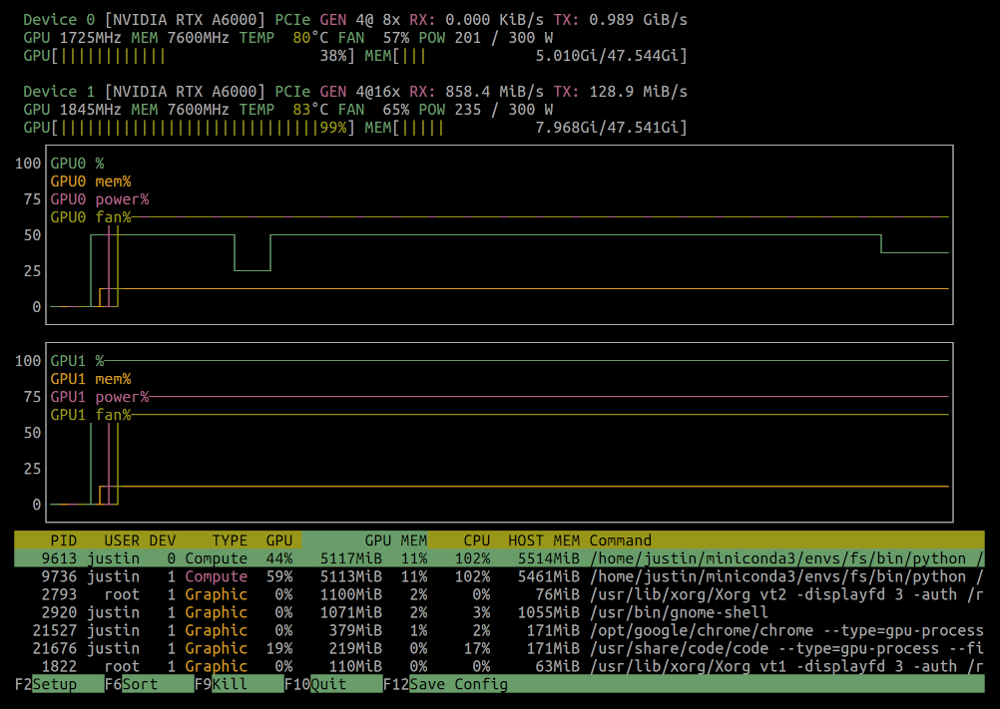
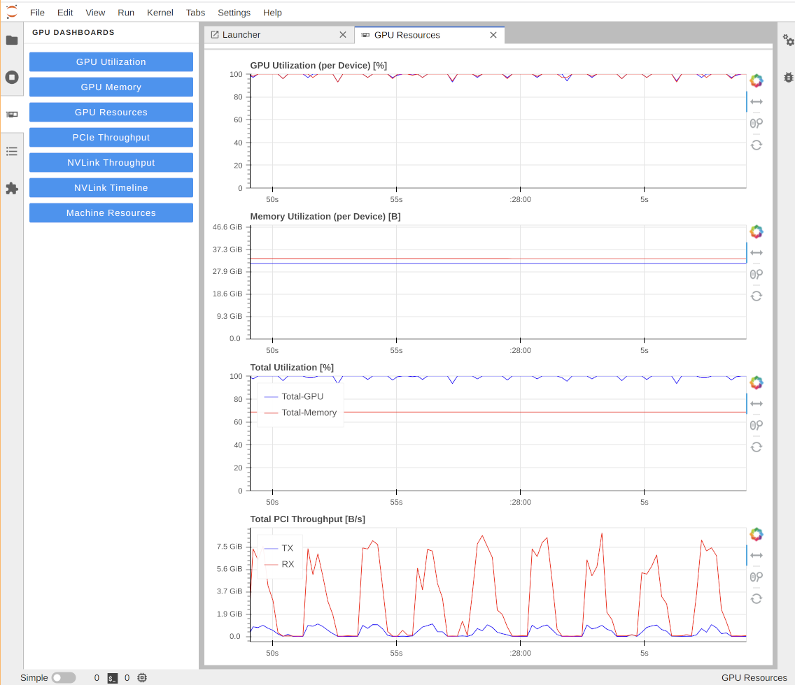
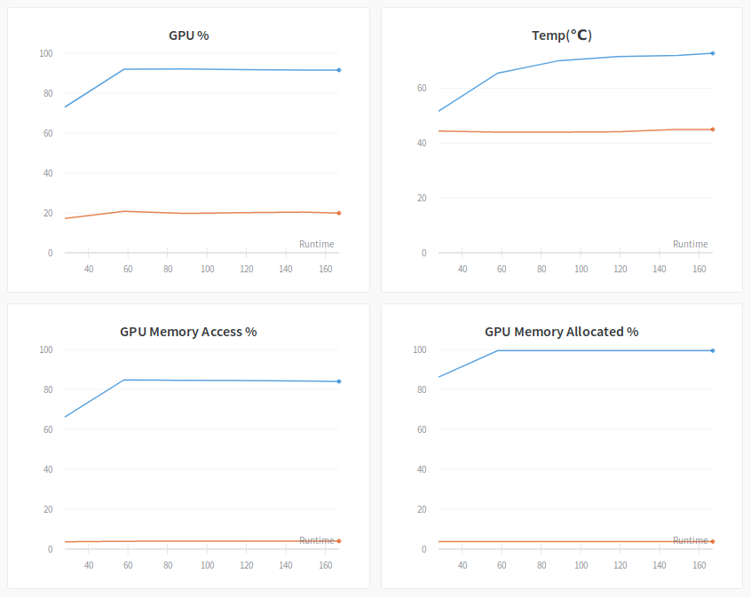
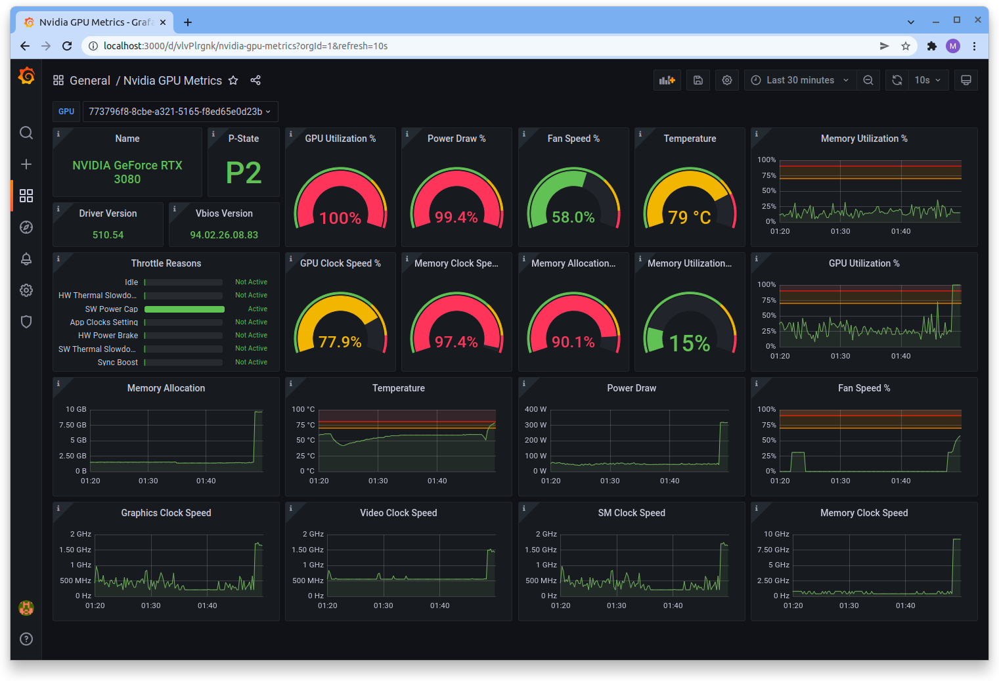

# Monitoring

## CPU & RAM

### top

### htop

## GPU

### nvidia-smi

`watch -n 0.1 nvidia-smi`: Watch every 0.1 seconds the output of nvidia-smi

`nvidia-smi --query-gpu=timestamp,name,pci.bus_id,temperature.gpu,utilization.gpu,utilization.memory --format=csv -l 1`

Others:
- `nvidia-smi -q -d TEMPERATURE,PERFORMANCE`: To see the slowdown/shutdown behavieour based on their temperature. If you frequently see HW Slowdown is activated, you probably need to improve the cooling of your machine. 
- `nvidia-smi topo -m`: shows the “GPU topology“, which describes how GPUs are connected. The topology is important to understand if data transfers between GPUs are being made via direct memory access (DMA) or through host devices.

### gpustat

a Python libary (`pip install --user gpustat`) to in a more concise, prettier, and simpler way (one line per GPU)

### nvtop

### nvitop

### jupyterlab-nvdashboard

- `pip install --user jupyterlab_nvdashboard`

### Weights & Biases

### Grafana

### Reference

https://lambdalabs.com/blog/keeping-an-eye-on-your-gpus-2/